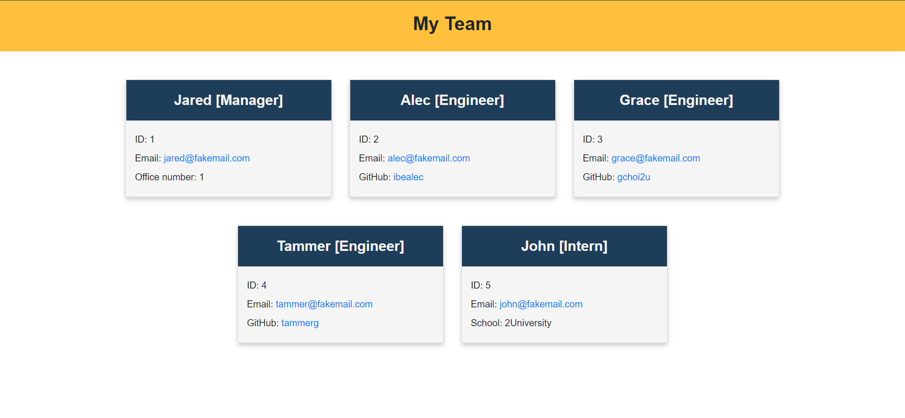

# Module 10 challenge: Team Profile Generator

## Description

This Module 10 Challenge repository was created to complete the Module 10 Challenge of the bootcamp.

This project aims to build a team profile generator HTML website using only Node JS and JavaScript, while also
applying Object Oriented Programming techniques and include some degree of testing. To start the program, simply 
type "node index.js" in the command line, and there will be a series of prompts asking you information about your
team member. An HTML webpage named "index.html" will be created as the end result. 

## Installation

Please make sure to run the command "npm install" to install all required node modules before running the program. 

## Usage

Please run the command "npm run test" to run all the test suites, and "node index.js" to start the program. 

Link to the demonstration video: https://drive.google.com/file/d/1ArC9ggkeItqI-c9G5g4FXi9yxpFwwkd1/view

## Credits

N/A

## License

N/A
